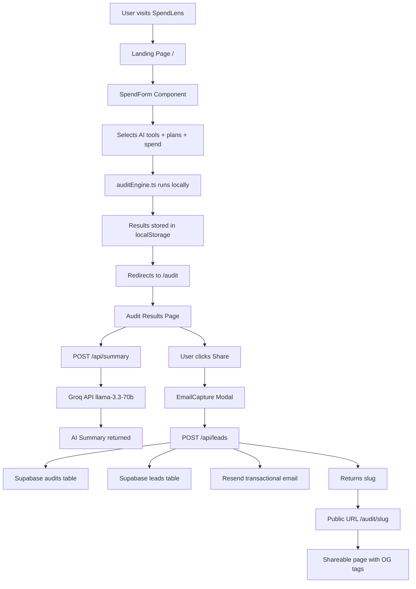

# SpendLens Architecture

SpendLens is built as a lightweight, client-side first application that offloads heavy computation and persistent storage to serverless APIs.

## 1. SYSTEM DIAGRAM

---

## 2. DATA FLOW

The transition from raw user input to a polished audit result follows this sequence:

1.  **Input:** User selects tools and enters spend/seat counts in the `SpendForm`.
2.  **Persistence:** Form state is saved to `localStorage` on every change to prevent data loss on accidental refresh.
3.  **Audit Trigger:** On submission, the `AuditInput[]` array is passed to `runAudit()`.
4.  **Local Engine:** The `auditEngine` evaluates each tool against `pricingData`. This is a pure TypeScript operation with **no API calls**, ensuring instant feedback.
5.  **Summary Generation:** The resulting `AuditSummary` is saved to `localStorage`.
6.  **Navigation:** User is redirected to the `/audit` page.
7.  **Hydration:** The page reads the `AuditSummary` from `localStorage` to render the initial breakdown.
8.  **AI Enrichment:** Simultaneously, the client fetches a personalized prose summary from `/api/summary` (powered by Groq).
9.  **User Experience:** Results are visible instantly, while the AI summary streams/loads in 2–3 seconds.

---

## 3. WHY THIS STACK?

*   **Next.js 14 App Router:** Provides API routes, SSR, and seamless Vercel deployment in a single unified framework.
*   **TypeScript:** Ensures the audit engine logic is type-safe; precision is critical when calculating potential savings.
*   **Tailwind CSS:** Enables the rapid construction of a polished, high-contrast dark UI without dedicated design assets.
*   **Supabase:** Offers a "backend-less" experience with a robust Postgres database, RLS security, and easy client libraries.
*   **Groq:** Provides the fastest inference available (Llama-3.3-70b) on a generous free tier, ideal for generating audit summaries.
*   **Resend:** Simplest transactional email API for sending audit reports, with a free tier covering 3,000 emails/month.
*   **Vercel:** Zero-config deployment with built-in edge functions and global CDN performance.

---

## 4. WHAT I'D CHANGE AT 10K AUDITS/DAY

Scaling to high-volume traffic would require the following architectural evolutions:

*   **Rate Limiting:** Move from in-memory maps to **Upstash Redis** to ensure limits survive server restarts and span across multiple edge instances.
*   **Asynchronous Processing:** Implement a job queue (e.g., Inngest or Upstash QStash) for `/api/leads` so the user doesn't wait for the Resend API to respond.
*   **Audit Caching:** Implement caching for common tool+plan+seats combinations, as they always produce the same result.
*   **Dynamic Assets:** Use `@vercel/og` to generate personalized Open Graph images for every shareable audit link, improving social click-through rates.
*   **Enhanced Analytics:** Integrate **PostHog** for deeper funnel tracking and session replays to identify UX friction points.
*   **Pricing Management:** Move `pricingData` to a headless CMS (like Sanity or Contentful) to allow pricing updates without requiring a full code deployment.
